# Configurando o provedor de identidade LDAP no OpenShift Container Platform e sincronizando grupos LDAP automaticamente

## Pré-requisitos

Para esse lab, precisaremos de:

  Um cluster OpenShift 4.12 [1] com um usuário tendo a função/papel `cluster-admin`.
  
  Um LDAP [2] com o schema de grupos e usuários definidos.

    Para o nosso lab, realizaremos nos próximos passos a implantação do OpenLDAP [3] no cluster OpenShift, isso é necessário pois não tenho um serviço de LDAP para integrar ao cluster OpenShift. Ah, o OpenLDAP para o nosso lab não ouvirá na porta HTTPS/SSL, logo, não teremos certificado.

    >>> Não faça isso para ambiente produtivo, pois não faz nenhum sentido ter o LDAP dentro do OpenShift.

  Podman [4]

## Exportando variáveis

Defina algumas variáveis que serão utilizadas ao longo desse lab.

```sh
export USERNAME=kubeadmin

export OPENSHIFT_URL_API=api.cluster-rxdvg.rxdvg.sandbox941.opentlc.com:6443

export OPENSHIFT_CONSOLE_PATH=console-openshift-console
  
export WILDCARD_DOMAIN=$(oc get route console -n openshift-console | awk '{ getline; print $2; }' | sed 's/'$OPENSHIFT_CONSOLE_PATH'\.//g'); echo $WILDCARD_DOMAIN
``````

## Implantação do LDAP no OpenShift

### Acesse o OpenShift via terminal.

```sh
oc login --username=$USERNAME --server=$OPENSHIFT_URL_API
```

### Expondo o registry

  > Por padrão, o registro de imagem do OpenShift é protegido durante a instalação do cluster para que ele atenda o tráfego por meio de TLS. Ao contrário das versões anteriores do OpenShift Container Platform, o registro não é exposto fora do cluster no momento de instalação. 

_Precisamos expor o registry para que possamos fazer o pull das imagens via podman._

Definir defaultRoutepara true:

```sh
oc patch configs.imageregistry.operator.openshift.io/cluster --patch '{"spec":{"defaultRoute":true}}' --type=merge
```

Obtenha a rota de registro padrão:

```sh
export OPENSHIFT_REGISTRY_URL=$(oc get route default-route -n openshift-image-registry --template='{{ .spec.host }}')
```

Obtenha o certificado do Operador Ingress:

```sh
oc get secret -n openshift-ingress router-metrics-certs-default -o go-template='{{index .data "tls.crt"}}' | base64 -d | sudo tee /etc/pki/ca-trust/source/anchors/${HOST}.crt  > /dev/null
```

Habilite o certificado padrão do cluster para confiar na rota usando os seguintes comandos:

```sh
sudo update-ca-trust enable
```

Faça login com podman usando a rota padrão:

```sh
podman login -u $USERNAME -p $(oc whoami -t) $OPENSHIFT_REGISTRY_URL
```

### Provisionamento do namespace

Vamos criar um namespace que será utilizado para implantarmos o OpenLDAP e o PHPLDAPAdmin

```sh
oc new-project ldap --description="OpenLDAP - Community developed LDAP software" --display-name=ldap
```

### Passos referente a implantação do OpenLDAP

Vamos realizar a construção da imagem do OpenLDAP

```sh
podman build --no-cache -t $OPENSHIFT_REGISTRY_URL/ldap/openldap -f ./openldap/Containerfile.openldap
```

* Como pode ser observado, estamos utilizando o arquivo `./openldap/Containerfile.openldap`, nele copiamos o arquivo `bootstrap.ldif` para dentro da imagem para facilitar a construção da nossa estrutura inicial de usuários e grupos. Saiba mais em `bootstrap.ldif.md`

Agora vamos realizar o envio para o registry do OpenShift

```sh
podman push $OPENSHIFT_REGISTRY_URL/ldap/openldap
```

Esses próximos passos são referente ao deploy da aplicação no OpenShift.

Vamos criar uma conta de serviço para atribuírmos aos deployments OpenLDAP e PHPLDAPAdmin

```sh
oc create serviceaccount ldap-serviceaccount -n ldap
```

> Vamos adicionar a uma política `Security Context Constraint (SCC)` ao usuário de serviço recém criado, isso se faz necessário no nosso lab pois não customizamos a imagem para ser iniciada com usuário no-root e nem com portas não previlegiadas.
  
```sh
oc adm policy add-scc-to-user anyuid system:serviceaccount:ldap:ldap-serviceaccount
```

Agora vamos criar a aplicação OpenLDAP.

```sh
oc new-app --name openldap -i openldap -e LDAP_ADMIN_PASSWORD=secret -e OPENLDAP_DEBUG_LEVEL=-1 -e CONTAINER_LOG_LEVEL=-1
```

Precisamos atribuir a conta de serviço ao deployment OpenLDAP

```sh
oc set serviceaccount deployment openldap ldap-serviceaccount
```

Para que nosso trabalho fique persistido precisamos definir pontos de montagem para o volume de dados utilizado pelo OpenLDAP

> Execute o seguinte comando para criar PVCs no Openshift e montar volumes para o pod OpenLDAP para persistir os dados criados nele.

```sh
oc set volume deployment/openldap --add --name=ldap-data --mount-path=/var/lib/ldap -t pvc --claim-name=ldap-data --claim-size=5G
```

```sh
oc set volume deployment/openldap --add --name=ldap-config --mount-path=/etc/ldap/slapd.d -t pvc --claim-name=ldap-config --claim-size=1G
```

Aguardamos até que o deployment esteja Ready
  
```sh
watch -n2 oc get pods -n ldap
```

### Passos referente a implantação do PHPLDAPAdmin

Vamos realizar a construção da imagem do

```sh
podman build --no-cache -t $OPENSHIFT_REGISTRY_URL/ldap/phpldapadmin -f ./phpldapadmin/Containerfile.phpldapadmin
```

Agora vamos realizar o envio para o registry do OpenShift

```sh
podman push $OPENSHIFT_REGISTRY_URL/ldap/phpldapadmin
```

Vamos armazenar o hostname do serviço OpenLDAP recém implantado, dessa forma quando precisarmos mais adiante, podemos consultar via variável ou reutilizar nos comandos que necessitarmos.

```sh
export LDAP_HOST=$(oc get svc openldap -o go-template --template='{{.metadata.name}}.{{.metadata.namespace}}.svc.cluster.local{{println}}') ; echo $LDAP_HOST
```

Agora vamos criar a aplicação PHPLDAPAdmin
  
```sh
oc new-app --name phpldapadmin -i phpldapadmin -e PHPLDAPADMIN_LDAP_HOSTS=$LDAP_HOST
```

Precisamos atribuir a conta de serviço ao deployment PHPLDAPAdmin

```sh
oc set serviceaccount deployment phpldapadmin ldap-serviceaccount
```

Como essa aplicação PHPLDAPAdmin é uma interface web, precisamos externalizar o acesso, para isso precisamos executar o comando abaixo para exportamos a rota para o serviço PHPLDAPAdmin

```sh
oc expose svc/phpldapadmin -n ldap ; oc get route phpldapadmin -n ldap | awk '{ getline; print $2; }'
```

Aguardamos até que o deployment esteja Ready
  
```sh
watch -n2 oc get pods -n ldap
```

> Pronto, agora podemos acessar a rota exposta anteriormente e informar as credenciais de acesso abaixo:

#### Credenciais de acesso ao LDAP
> Login DN: `cn=admin,dc=your,dc=company,dc=com`
>
> Password: `secret`

**Tela de boas vindas do OpenLDAP**

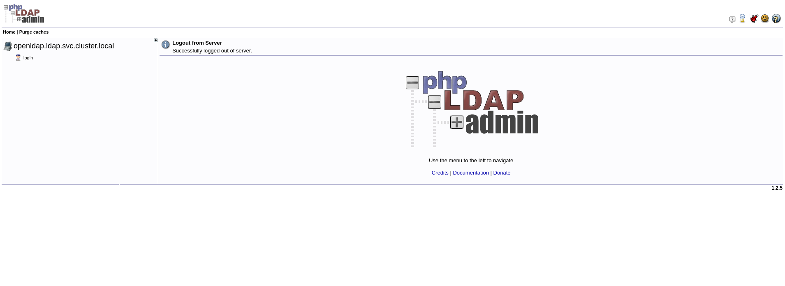

**Tela de login do OpenLDAP**

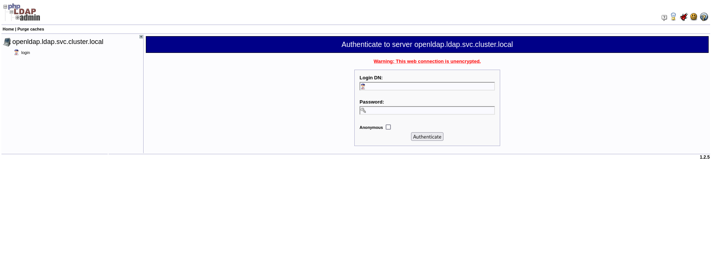

**Tela do OpenLDAP após o login**

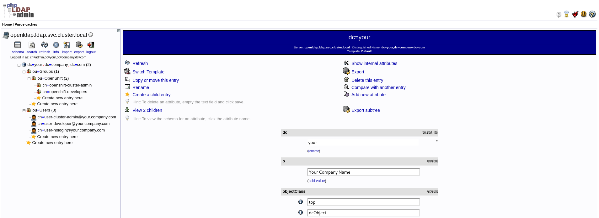

# Configurando o provedor de identidade LDAP

### Criando um secret LDAP

Para usar o provedor de identidade, deve-se definir um objeto **OpenShift Container Platform Secret** que contenha o campo bindPassword no namespace `openshift-config`

```sh
oc create secret generic ldap-bind-password --from-literal=bindPassword=secret -n openshift-config
```

## Recurso Customizado LDAP

O CR [5] (Recurso customizado) a seguir mostra os parâmetros e valores aceitáveis ​​para um provedor de identidade LDAP.

```sh
oc apply -f LDAPIdentityProviderConfig.yaml
```

Após aplicar o LDAP CR, precisamos aguardar o rollout dos POD's com prefixo `oauth-openshift-*` no namespace `openshift-authentication``, somente após o restart a opção de login via ldap será apresentada na tela de login do OpenShift.

```sh
watch -n2 oc get pods -n openshift-authentication
```

**Tela de login do OpenShift sem identity provider LDAP configurado**

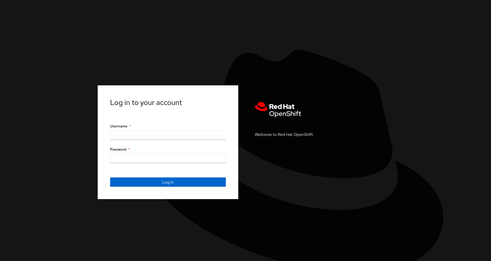


**Tela de login do OpenShift com identity provider LDAP configurado**

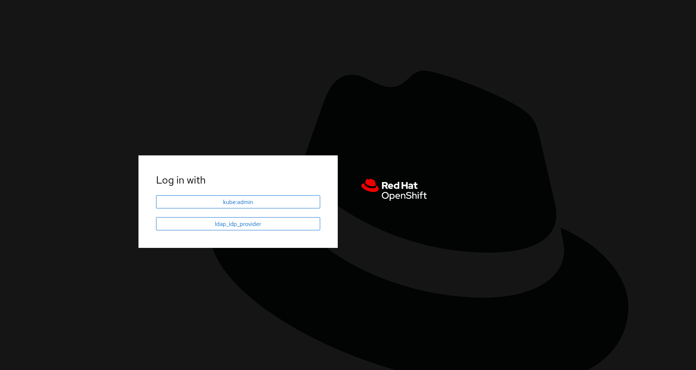

# Sincronizando grupos LDAP automaticamente

Você pode sincronizar automaticamente grupos LDAP periodicamente configurando um cron job.

*Nesse ponto já temos configurado o identity provider LDAP (IDP).*

#### Crie um projeto onde o CronJOB será executado:
```sh
oc new-project ldap-sync
```

Precisamos criar o objeto **OpenShift Container Platform Secret** no namespace recem criado.

```sh
oc create secret generic ldap-bind-password --from-literal=bindPassword=secret -n ldap-sync
```

Agora precisamos criar uma conta de serviço no qual será utilizada pelo CronJOB

```sh
oc create serviceaccount ldap-group-syncer -n ldap-sync
```

Crie a função de cluster:
```sh
oc create -f ldap-sync-cluster-role.yaml
```

Crie a vinculação da função de cluster:
```sh
oc create -f ldap-sync-cluster-role-binding.yaml
```

Crie um mapa de configuração que especifique o arquivo de configuração de sincronização:
```sh
oc create -f ldap-sync-config-map.yaml
```

E por fim, crie um cron job:
```sh
oc create -f ldap-sync-cron-job.yaml
```

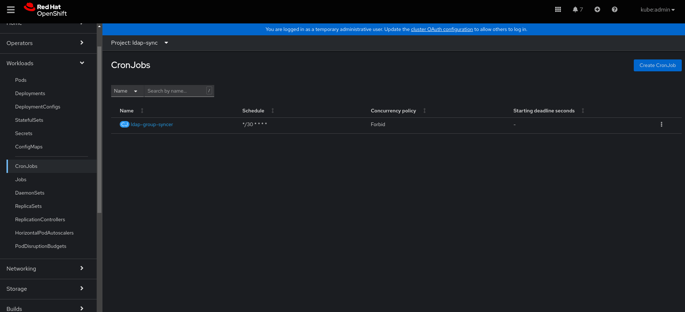


> Pronto, nesse ponto você terá um processo automatizado de sincronização de grupos de LDAP, agora é só aguardar o time do job!

_Evidências do lab realizado, incluíndo a sincronização dos usuários e grupos do OpenLDAP_

_Aproveitei para definir permissões para os grupos importados assim meu controle de permissão em relação ao OpenShift fica atrelado ao grupo e não ao usuário_


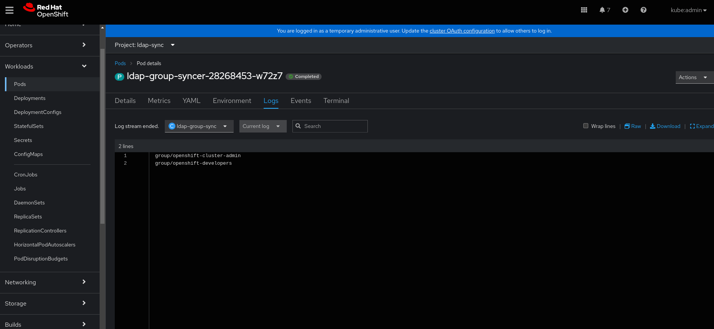
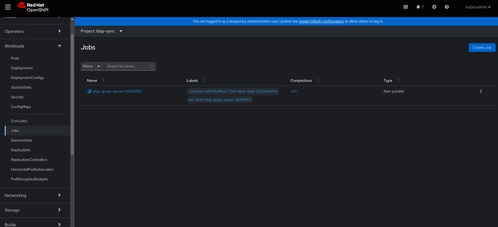

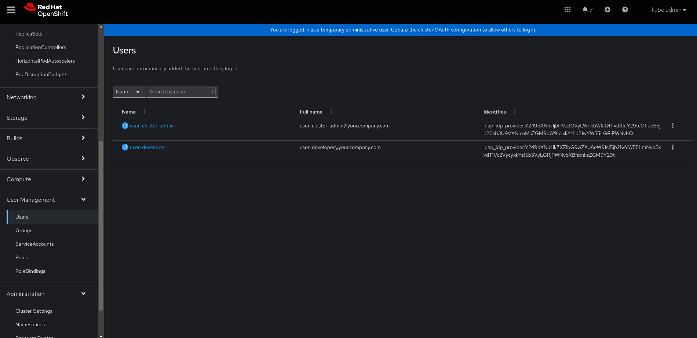
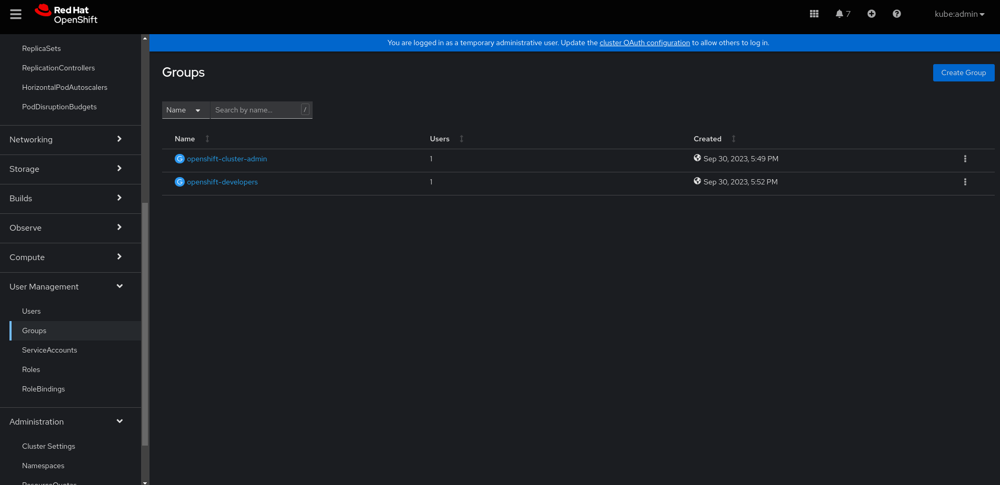

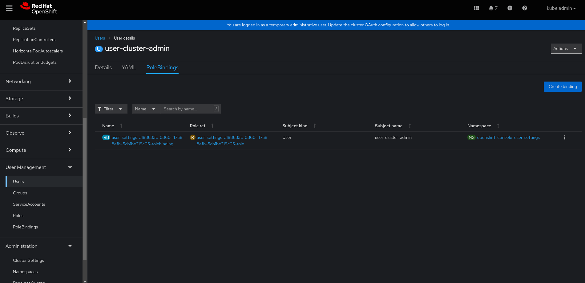
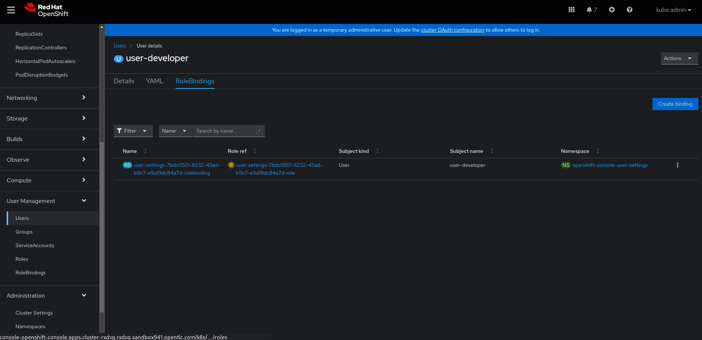

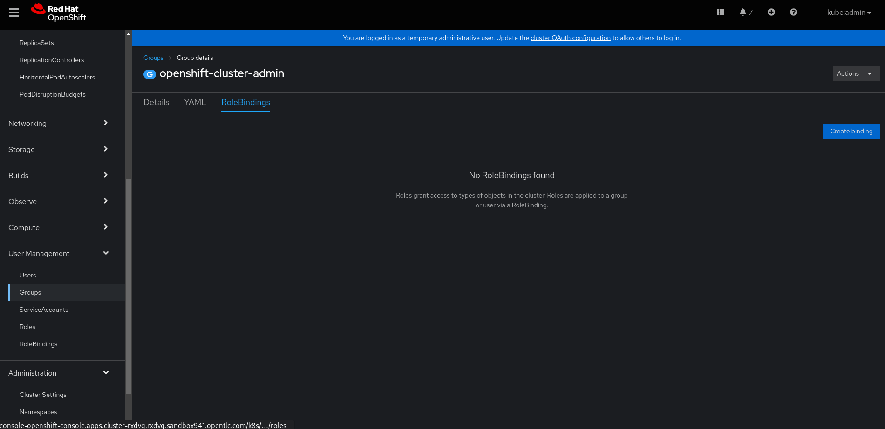


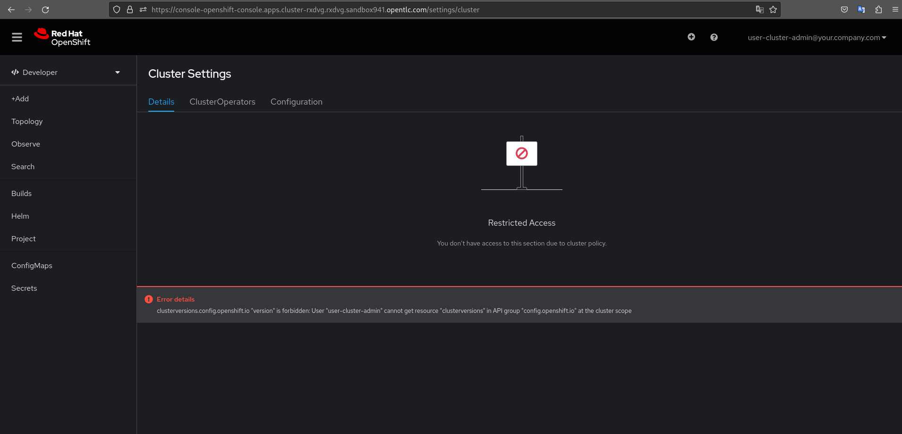
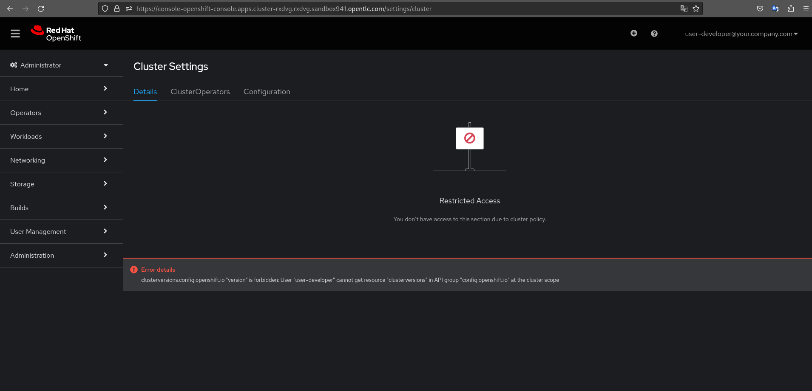

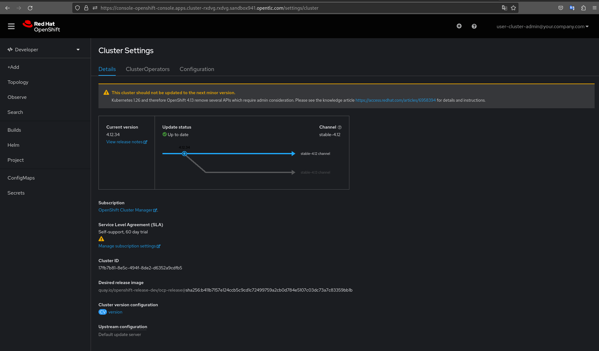
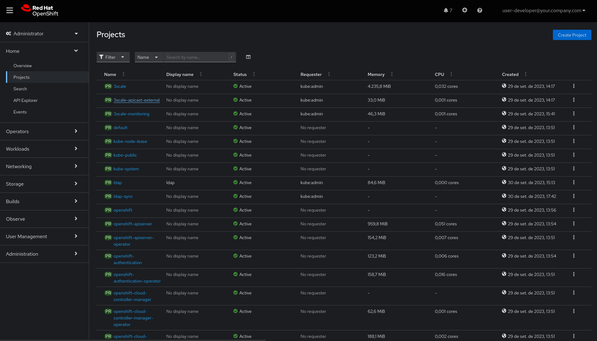

# Referências:

_[1] - https://www.redhat.com/pt-br/technologies/cloud-computing/openshift_

_[2] - https://ldap.com/_

_[3] - https://www.openldap.org/_

_[4] - https://podman.io/_

_[5] - https://docs.openshift.com/container-platform/3.11/dev_guide/creating_crd_objects.html_

_https://docs.openshift.com/container-platform/4.12/authentication/identity_providers/configuring-ldap-identity-provider.html_

_https://docs.openshift.com/container-platform/4.12/authentication/ldap-syncing.html_

_https://www.linkedin.com/pulse/deploying-openldap-openshift-users-bootstrapped-ritesh-raj_